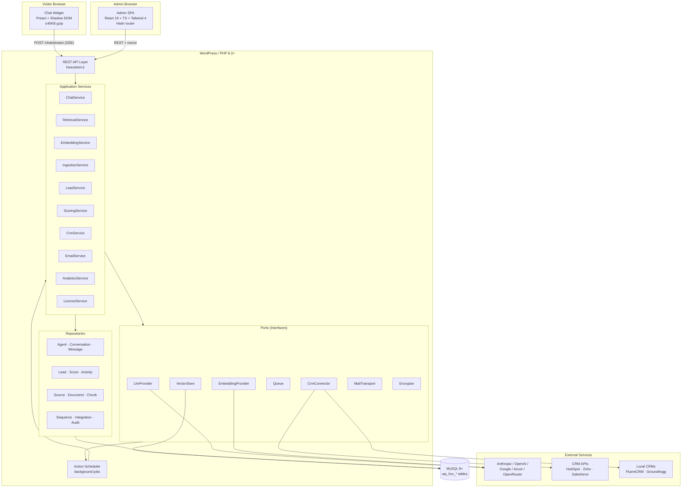
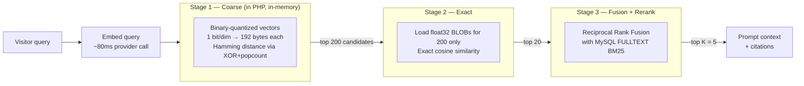
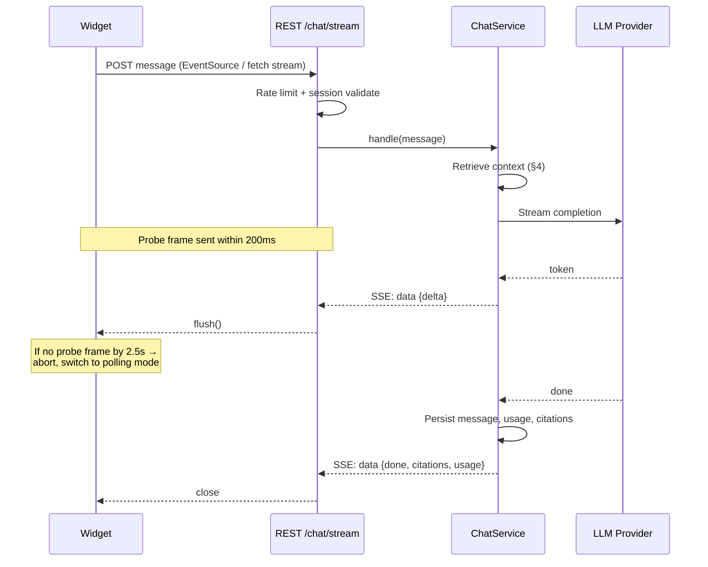
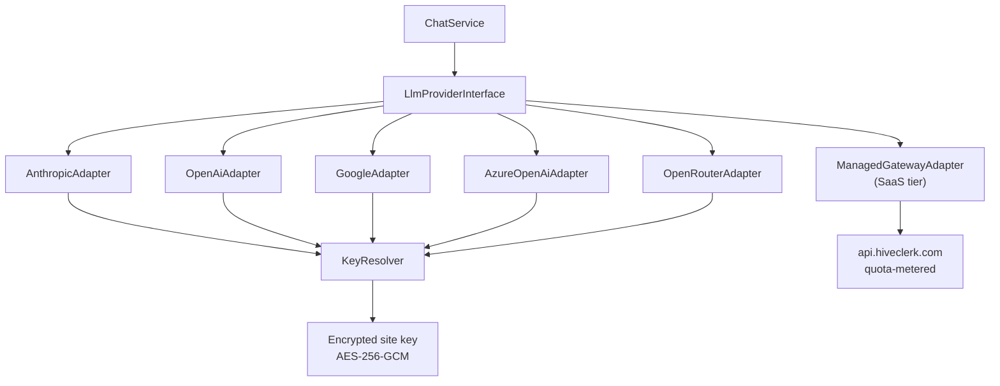
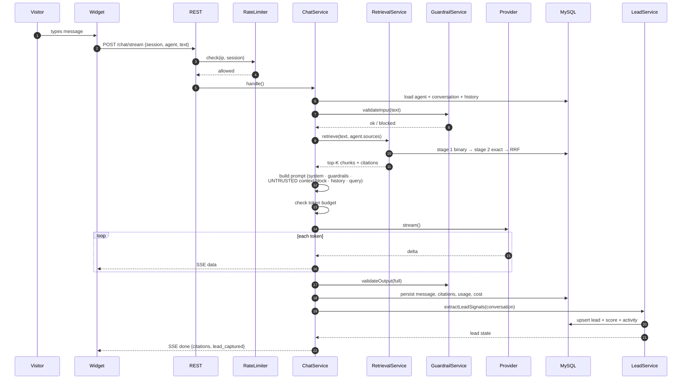
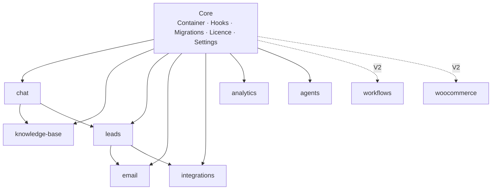

# Hiveclerk — System Architecture

**Deliverable 6 of 16** · Version 1.0 · Status: **Draft — awaiting approval** · 2026-08-05

This document resolves technical decisions TD-1 through TD-6 from the PRD.

---

## 1. Architectural Principles

| # | Principle | Consequence |
|---|---|---|
| 1 | **The service layer never knows it is inside WordPress** | Services depend on interfaces (`ClockInterface`, `QueueInterface`, `RepositoryInterface`), never on `$wpdb`, `get_option`, or `wp_mail` directly. This is what makes the V3 SaaS extraction possible rather than a rewrite. |
| 2 | **Every external dependency sits behind a port** | Model providers, embedding providers, CRMs, email transport, and vector storage are all swappable adapters. |
| 3 | **Anything slow is a job, never a request** | Crawling, embedding, CRM sync, and email sending run through Action Scheduler. No HTTP request performs unbounded work. |
| 4 | **Retrieved content is data, never instruction** | All knowledge-base text and visitor input is delimiter-isolated and explicitly untrusted in prompts. |
| 5 | **Modules are independently removable** | Each module registers itself; deleting a module directory degrades the product, never fatals it. |
| 6 | **Fail soft on the front end** | A provider outage, expired licence, or exhausted budget produces a graceful fallback message, never a broken page. |

---

## 2. High-Level System Diagram



---

## 3. Layered Architecture

```
┌──────────────────────────────────────────────────────────────┐
│ PRESENTATION   Admin SPA (React 19)  ·  Public Widget (Preact)│
├──────────────────────────────────────────────────────────────┤
│ API            REST controllers · request validation ·        │
│                capability + nonce checks · rate limiting      │
├──────────────────────────────────────────────────────────────┤
│ APPLICATION    Services · orchestration · transactions ·      │
│                domain events                                  │
├──────────────────────────────────────────────────────────────┤
│ DOMAIN         Entities · value objects · DTOs · domain rules │
│                (zero framework dependencies)                  │
├──────────────────────────────────────────────────────────────┤
│ PERSISTENCE    Repositories over $wpdb · query builders ·     │
│                migrations                                     │
├──────────────────────────────────────────────────────────────┤
│ INFRASTRUCTURE Provider adapters · queue · cache · crypto ·   │
│                HTTP client · logger                           │
└──────────────────────────────────────────────────────────────┘
```

**Dependency rule:** dependencies point downward only. The domain layer imports nothing. A service receives its collaborators through constructor injection from a PSR-11 container; nothing calls a global.

---

## 4. TD-1 — Vector Storage and Retrieval ⚑ Most consequential decision

### 4.1 The constraint

MySQL 9's native `VECTOR` type is unavailable on essentially all shared WordPress hosting. Bundling an external vector database is impossible. Computing cosine similarity in PHP across 50,000 float32 vectors of 1,536 dimensions is roughly 300 MB of memory and several seconds — far outside the request budget.

### 4.2 The design — binary-quantized two-stage retrieval



### 4.3 Why this works on shared hosting

| Stage | Data volume at 10,000 chunks | Cost |
|---|---|---|
| Binary matrix held in object cache | 10,000 × 192 B = **1.9 MB** | Loaded once, cached |
| Stage 1 Hamming over full set | 10,000 XOR + popcount on 192-byte strings | **~15–30 ms** |
| Stage 2 exact cosine | 200 × 6 KB = 1.2 MB loaded from DB | **~20 ms** |
| Stage 3 FULLTEXT + RRF | Single indexed query | **~10 ms** |
| **Total retrieval** | | **< 100 ms**, well inside NFR-03's 300 ms budget |

Binary quantization retains roughly 95% of recall at top-200 for modern embedding models — and Stage 2 corrects the ordering exactly, so the coarse pass only needs to get candidates *into* the set, not rank them correctly.

### 4.4 Storage layout

```sql
-- Exact vector, used only for the 200 survivors of Stage 1
embedding_f32   LONGBLOB     -- packed float32, 1536 dims = 6,144 bytes
-- Quantized vector, scanned for every query
embedding_bits  VARBINARY(256) -- 1 bit per dimension, 1536 dims = 192 bytes
dimensions      SMALLINT UNSIGNED
provider        VARCHAR(32)
model           VARCHAR(64)
```

**Quantization rule:** `bit[i] = 1 if vector[i] > 0 else 0`. Packed with PHP `pack('C*', ...)`; Hamming distance computed as `substr_count(unpack-free XOR, ...)` via a precomputed 256-entry popcount table.

**Matryoshka optimisation (V1.x).** Providers supporting Matryoshka embeddings (OpenAI `text-embedding-3-*`, Gemini) allow truncation to 256 dimensions with minimal loss. Where available, Stage 1 uses a truncated float32 vector instead of binary quantization for better recall at similar cost.

### 4.5 Scaling ladder

| Chunk count | Strategy | Tier |
|---|---|---|
| ≤ 500 | Single-stage exact cosine, no quantization | Free |
| 500 – 25,000 | Two-stage as described, binary matrix in object cache | Pro / Business |
| 25,000 – 100,000 | Two-stage + per-source partitioned matrices, loaded only for the clerk's assigned sources | Agency |
| > 100,000 | `VectorStore` adapter swaps to an external service (Qdrant / pgvector / Pinecone) | SaaS |

**This is why `VectorStoreInterface` exists from day one.** The SaaS tier changes one binding in the container; no service code changes.

### 4.6 Rejected alternatives

| Option | Why rejected |
|---|---|
| MySQL 9 `VECTOR` type | Not available on target hosting; would exclude the majority of the addressable market |
| Bundled SQLite + sqlite-vec | Requires a PHP extension not present on shared hosts; second datastore to back up and migrate |
| External vector DB in V1 | Breaks the "your data never leaves your server" pillar — our primary differentiator |
| Naive full-scan float32 cosine | Exceeds memory and time limits above ~5,000 chunks |

---

## 5. TD-2 — Streaming Transport

### 5.1 Decision: Server-Sent Events with automatic polling fallback

WebSockets are unavailable on most shared hosting. SSE works over plain HTTP but is defeated by output buffering in nginx (`proxy_buffering on`), some FastCGI configurations, and several caching layers.



**Buffering detection.** The endpoint emits a `:probe` comment frame immediately on connection. If the widget has not received it within 2,500 ms, it aborts, sets a persisted `hvc_transport=poll` flag, and re-issues the request against `/chat/message` + `/chat/poll`. The detection runs once per session, not per message.

**Server-side flush sequence:** disable `zlib.output_compression`, send `X-Accel-Buffering: no` and `Cache-Control: no-cache, no-transform`, call `ob_end_flush()` on all levels, then `flush()` after each frame. A 4 KB padding comment is sent on connect to defeat fixed-size buffers.

**Host compatibility must be verified in Sprint 3** against the five largest shared hosts. This is risk R-2 in the PRD and it is the single most likely source of launch-day support tickets.

---

## 6. TD-3 — Background Processing

**Decision: Action Scheduler**, already a dependency of WooCommerce and thus present on a large share of target sites.

| Job group | Jobs | Concurrency |
|---|---|---|
| `hvc_ingest` | crawl_url, parse_document, chunk_document, embed_chunk_batch | 1 |
| `hvc_sync` | crm_push_contact, crm_push_activity, crm_retry | 2 |
| `hvc_mail` | sequence_tick, send_email | 1 |
| `hvc_maint` | purge_retention, recompute_scores, refresh_binary_matrix | 1 |

**Batching rule.** Every job processes a bounded batch (default 25 items) and re-enqueues itself if work remains. No job may exceed 20 seconds, keeping it inside a 30-second `max_execution_time` with headroom.

**Cron reliability.** `wp-cron` is unreliable on low-traffic sites. The system status page (FR-SYS-07) surfaces queue depth and last-run time, and documents the `DISABLE_WP_CRON` + real cron setup.

---

## 7. TD-4 — Admin SPA Integration

**Decision: hash router**, mounted on a single WordPress admin page.

```
wp-admin/admin.php?page=hiveclerk#/dashboard
                                  #/clerks/12/knowledge
                                  #/conversations?status=handoff
```

A browser router would require rewrite rules and server configuration that cannot be guaranteed. The hash router needs neither.

**Mount contract.** PHP renders a single `<div id="hvc-root">` plus a `window.HVC_BOOT` object containing the REST root, nonce, current user capabilities, licence tier, locale, and white-label branding. The SPA hydrates from that — no extra round-trip before first paint.

**Asset isolation.** Vite builds to `assets/admin/` with hashed filenames. The admin bundle enqueues only on our page. `wp-admin` CSS is neutralised inside `#hvc-root` with a scoped reset so WordPress core styles cannot bleed into Tailwind.

---

## 8. TD-5 — Model Key Custody and TD-6 — Provider Abstraction



**`LlmProviderInterface`** exposes `complete()`, `stream()`, `countTokens()`, `capabilities()`, and `pricing()` — the last so cost tracking works uniformly across providers.

**Key encryption.** Keys are encrypted with AES-256-GCM using a key derived from `AUTH_KEY`/`SECURE_AUTH_KEY` salts plus a per-install random salt stored separately. Encrypted values never leave the server; the SPA receives only a masked `sk-…4f2a` display value and a boolean `is_set`.

**Embedding provider pinning.** Each `knowledge_source` records the provider, model, and dimension used. Changing providers does not silently corrupt retrieval — it marks affected sources as `needs_reembedding` and offers a targeted re-index job.

---

## 9. Chat Request Flow (end to end)



**Prompt assembly is security-critical.** Retrieved chunks and visitor input are wrapped in explicit delimiters and preceded by an instruction stating that content within them is untrusted data and must never be followed as instructions. See Deliverable 15 §Prompt Injection.

---

## 10. Knowledge Ingestion Pipeline

```mermaid
flowchart LR
    subgraph Sources
        S1["WP posts/pages/CPT"]
        S2["WooCommerce products"]
        S3["Website crawl"]
        S4["PDF / DOCX"]
        S5["FAQ / raw text"]
    end

    Sources --> EX["Extractor<br/>per source type"]
    EX --> NM["Normalise<br/>strip chrome, HTML→text,<br/>preserve heading path"]
    NM --> DOC[("documents")]
    DOC --> CK["Chunker<br/>~800 tokens, 15% overlap,<br/>heading-aware splits"]
    CK --> CHK[("chunks")]
    CHK --> HASH{"content_hash<br/>changed?"}
    HASH -->|no| SKIP["Skip — reuse embedding"]
    HASH -->|yes| EMB["EmbeddingService<br/>batch 96 per call"]
    EMB --> QNT["Quantize → bits"]
    QNT --> VEC[("embeddings")]
    VEC --> IDX["Invalidate cached<br/>binary matrix"]
```



**Content hashing prevents re-embedding cost.** A re-sync only embeds chunks whose SHA-256 changed. For a typical site re-sync this reduces provider spend by well over 90%.

**Crawler discipline.** Respects `robots.txt`, sends a `Hiveclerk/1.0` user agent, enforces per-host concurrency of 1 with a 1-second delay, caps page count by tier, and refuses non-HTML content types.

---

## 11. Module Architecture

Each module is self-registering and independently removable.



**Module contract.** Every module implements `ModuleInterface`:

```php
interface ModuleInterface {
    public static function id(): string;
    public function register(ContainerInterface $c): void;  // bind services
    public function boot(): void;                            // add hooks
    public function migrations(): array;                     // schema deltas
    public function capabilities(): array;                   // required caps
    public function isAvailable(): bool;                     // licence/dependency gate
}
```

Modules communicate through a domain event bus, never by calling each other's services directly. `LeadCaptured`, `ConversationEnded`, `SourceIndexed`, `ScoreChanged` are V1 events. This is what lets the V2 workflow builder subscribe to everything without modifying existing modules.

---

## 12. Caching Strategy

| Cached | Store | TTL | Invalidated by |
|---|---|---|---|
| Binary embedding matrix (per source set) | Object cache → transient fallback | 24 h | Source re-index |
| Agent configuration | Object cache | 1 h | Agent save |
| Retrieval results (identical query + source set) | Transient | 15 min | Source re-index |
| Provider model list / pricing | Transient | 24 h | Manual refresh |
| Analytics aggregates | Custom rollup table | 1 h | Scheduled rollup job |
| Licence status | Transient | 12 h | Manual re-check |

**Persistent object cache is strongly recommended, not required.** Where Redis or Memcached is absent, the binary matrix falls back to transients; the status page reports the degradation and its performance impact.

---

## 13. Security Architecture

Full treatment in Deliverable 15. Architectural commitments:

| Control | Implementation |
|---|---|
| Authentication (admin) | WordPress cookie auth + `X-WP-Nonce`; capability check on every route |
| Authentication (public) | Signed session token, HMAC'd, bound to site + expiry; no PII in the token |
| Authorisation | Custom capabilities: `hiveclerk_manage_agents`, `_view_conversations`, `_manage_leads`, `_manage_settings`, `_manage_integrations` |
| Rate limiting | Sliding window per IP **and** per session, backed by object cache with a DB fallback |
| Input | Sanitised at the boundary; validated against a schema per route |
| Output | Escaped at render; SPA never uses `dangerouslySetInnerHTML` on model output without sanitisation |
| SQL | `$wpdb->prepare()` universally; repositories are the only layer touching SQL |
| Secrets | AES-256-GCM at rest; never returned to a client |
| Prompt injection | Retrieved content delimiter-isolated and declared untrusted; output filtered before display |
| Audit | All configuration mutations logged with actor, timestamp, and diff |
| Transport | All provider calls over TLS with certificate verification enforced |

---

## 14. Performance Budget

| Path | Budget | Enforcement |
|---|---|---|
| Widget JS (gzipped) | ≤ 40 KB | CI bundle-size check fails the build |
| Widget LCP impact | ≤ 50 ms | Lighthouse CI on a reference theme |
| Time to first token | ≤ 1.5 s p95 | Instrumented; surfaced in analytics |
| Retrieval | ≤ 300 ms p95 | Benchmark suite at 1k / 10k / 50k chunks |
| Admin REST p95 | ≤ 400 ms | Query-count assertions in integration tests |
| Admin bundle | ≤ 350 KB gzipped | CI check; route-level code splitting |
| Peak memory per request | ≤ 96 MB | Profiled in the benchmark suite |

---

## 15. SaaS Extraction Path

The architecture is designed so the V3 SaaS is a rebinding, not a rewrite.

| Concern | Self-hosted binding | SaaS binding |
|---|---|---|
| `VectorStoreInterface` | `MysqlBlobVectorStore` | `QdrantVectorStore` |
| `LlmProviderInterface` | `AnthropicAdapter` + site key | `ManagedGatewayAdapter` + quota |
| `QueueInterface` | `ActionSchedulerQueue` | `SqsQueue` |
| `RepositoryInterface` | `$wpdb` implementations | Same SQL against managed MySQL |
| Auth | WP cookies + nonce | OAuth 2.0 + team accounts |
| Billing | Licence key | Stripe subscription + usage metering |

**The rule that makes this real:** no service class may reference a WordPress function. Enforced by a PHPStan custom rule that fails CI on WordPress function calls outside the infrastructure and API layers.

---

## 16. Resolved Decisions Summary

| # | Decision | Resolution |
|---|---|---|
| TD-1 | Vector storage | **Binary-quantized two-stage retrieval over MySQL BLOBs**, behind `VectorStoreInterface` |
| TD-2 | Streaming | **SSE with probe-frame buffering detection and automatic polling fallback** |
| TD-3 | Background jobs | **Action Scheduler**, bounded self-re-enqueueing batches |
| TD-4 | SPA routing | **Hash router**, single admin page, boot object hydration |
| TD-5 | Key custody | **Both** — encrypted site key now, managed gateway adapter ready |
| TD-6 | Embeddings | **Pluggable**, with provider/model/dimension pinned per source |

---

**Approval:** ⬜ Awaiting sign-off · Reviewer: ______________ · Date: __________
