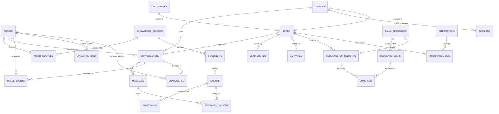
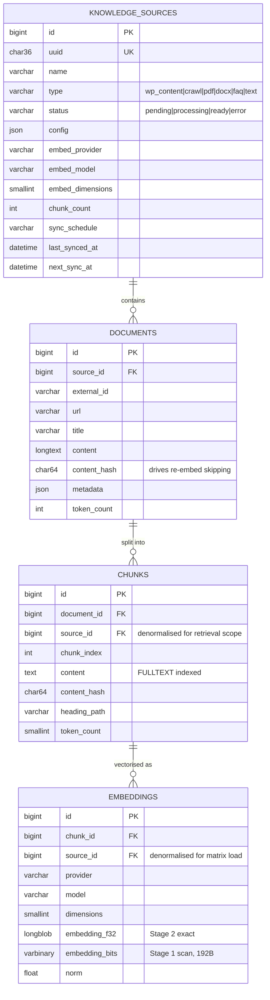
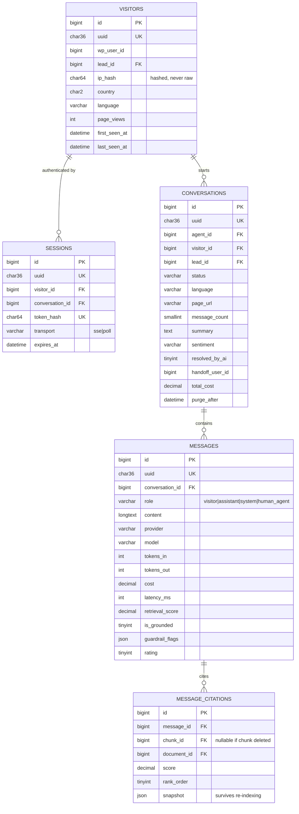
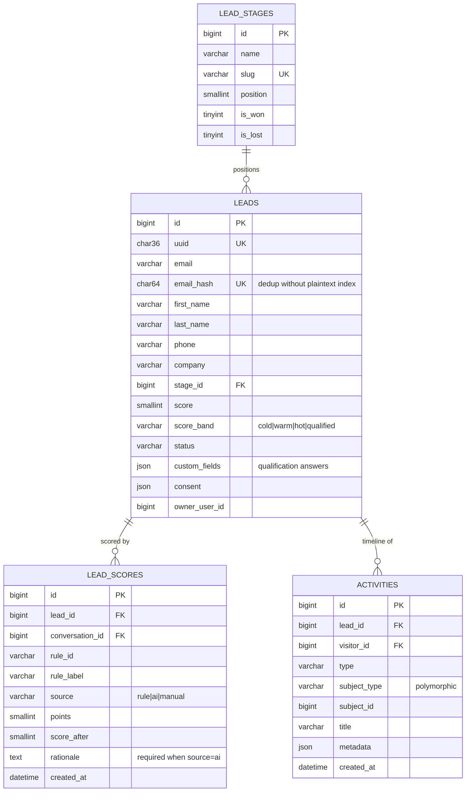
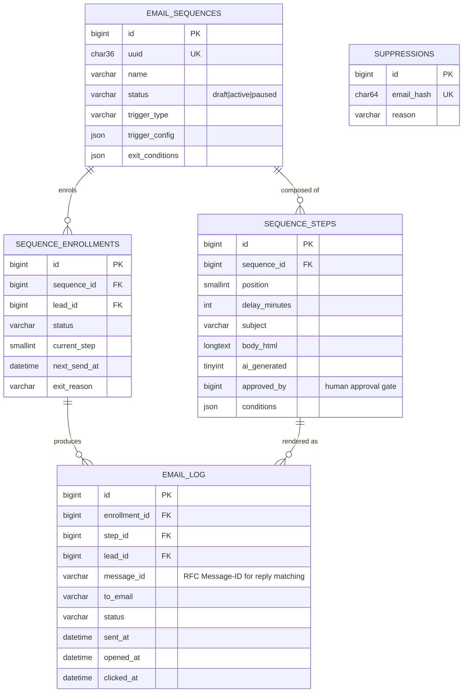
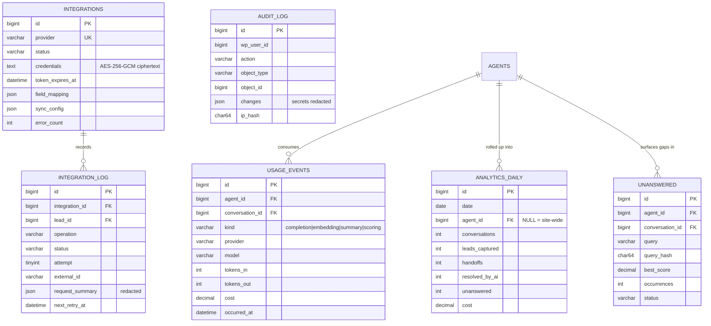

# Hiveclerk — Entity Relationship Diagram

**Deliverable 8 of 16** · Version 1.0 · Status: **Draft — awaiting approval** · 2026-08-05

Diagrams render natively on GitHub and in any Mermaid-capable viewer.

> **Note on notation.** Relationships shown are *logical*. As decided in Deliverable 7 §1.1, no `FOREIGN KEY` constraints exist at the database level — integrity is enforced in the repository layer.

---

## 1. Master ERD



---

## 2. Module ERDs

### 2.1 Knowledge Base



**Why four tables and not two.** Each level has a distinct lifecycle: a *source* is reconfigured, a *document* is re-fetched, a *chunk* is re-split, an *embedding* is regenerated when the provider changes. Collapsing them would force full re-embedding on any change — the single largest avoidable cost in the product.

### 2.2 Conversations



### 2.3 Leads



**`LEAD_SCORES` is append-only.** A score is never updated in place; each adjustment is a new row carrying its own rationale. `LEADS.score` is the materialised running total. This is what makes the score breakdown auditable for persona P3's sceptical sales team.

### 2.4 Email Automation



### 2.5 Integrations and Platform



---

## 3. Cardinality Reference

| From | To | Cardinality | Delete behaviour |
|---|---|---|---|
| `agents` | `conversations` | 1 : N | Restrict — archive the agent instead |
| `agents` | `agent_sources` | 1 : N | Cascade |
| `knowledge_sources` | `documents` | 1 : N | Cascade |
| `documents` | `chunks` | 1 : N | Cascade |
| `chunks` | `embeddings` | 1 : N | Cascade |
| `chunks` | `message_citations` | 1 : N | **Set NULL** — snapshot preserves the citation |
| `visitors` | `conversations` | 1 : N | Cascade |
| `visitors` | `leads` | 1 : 0..1 | Set NULL |
| `conversations` | `messages` | 1 : N | Cascade |
| `messages` | `message_citations` | 1 : N | Cascade |
| `leads` | `lead_scores` | 1 : N | Cascade |
| `leads` | `activities` | 1 : N | Cascade |
| `lead_stages` | `leads` | 1 : N | Restrict — reassign before deleting a stage |
| `email_sequences` | `sequence_steps` | 1 : N | Cascade |
| `email_sequences` | `sequence_enrollments` | 1 : N | Cascade |
| `sequence_enrollments` | `email_log` | 1 : N | **Set NULL** — retain send history |
| `integrations` | `integration_log` | 1 : N | Cascade |

`CascadeDeleteService` implements this table explicitly, ordering deletes children-first inside a transaction.

---

## 4. Hot Paths and Index Justification

The three queries that must never be slow:

### 4.1 Retrieval Stage 1 — every visitor message

```sql
SELECT id, chunk_id, embedding_bits
  FROM wp_hvc_embeddings
 WHERE source_id IN (?, ?, ?)
 ORDER BY id;
```
Served by `idx_source_scan (source_id, id)`. Result is cached as a packed binary matrix; the query runs on cache miss only.

### 4.2 Conversation transcript — admin detail view

```sql
SELECT * FROM wp_hvc_messages
 WHERE conversation_id = ?
 ORDER BY created_at ASC;
```
Served by `idx_conversation (conversation_id, created_at)` — index order matches sort order, so no filesort.

### 4.3 Dashboard trend — most-loaded admin screen

```sql
SELECT date, SUM(conversations), SUM(leads_captured), SUM(cost)
  FROM wp_hvc_analytics_daily
 WHERE date BETWEEN ? AND ?
 GROUP BY date;
```
Served by `idx_date`. **This is precisely why `analytics_daily` exists** — the equivalent query against `messages` and `usage_events` would scan hundreds of thousands of rows on every dashboard load.

---

## 5. Volume Projection

| Entity | Small site / yr | Mid store / yr | Agency site / yr |
|---|---:|---:|---:|
| Conversations | 600 | 20,000 | 60,000 |
| Messages | 3,600 | 120,000 | 360,000 |
| Citations | 9,000 | 300,000 | 900,000 |
| Chunks | 400 | 10,000 | 50,000 |
| Embeddings | 400 | 10,000 | 50,000 |
| Leads | 120 | 3,000 | 9,000 |
| Activities | 6,000 | 200,000 | 600,000 |
| **DB growth** | **~30 MB** | **~560 MB** | **~1.6 GB** |

The Agency column is where retention policy stops being optional. Default 12-month retention with nightly purge keeps steady-state size bounded rather than monotonically growing.

---

**Approval:** ⬜ Awaiting sign-off · Reviewer: ______________ · Date: __________
