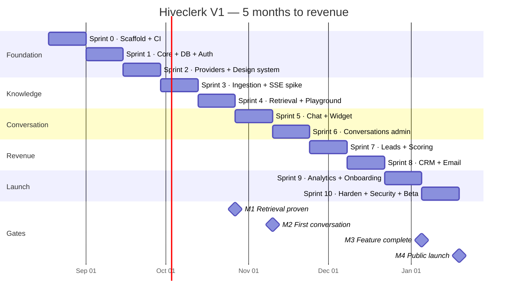
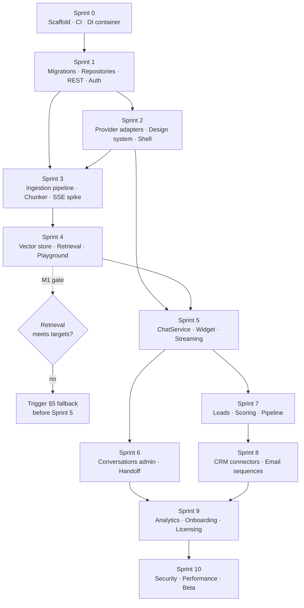

# Hiveclerk — Development Roadmap

**Deliverable 13 of 16** · Version 1.0 · Status: **Draft — awaiting approval** · 2026-08-05

---

## 1. Planning Assumptions

Stated explicitly because every date below depends on them. If any is wrong, the roadmap shifts.

| Assumption | Value |
|---|---|
| Team | 1 senior PHP/WordPress engineer · 1 senior React/TypeScript engineer · 1 designer (50%) · 1 product/QA (50%) |
| Sprint length | 2 weeks |
| Capacity | ~16 engineer-days per sprint after ceremonies, support, and review |
| Start | Sprint 0 begins on approval of Gate 4 |
| Buffer | 15% of every sprint reserved — unallocated, not "stretch goals" |
| Working assumption | WooCommerce read-only indexing in V1 (Q-3); FluentCRM first (Q-4) |

**Honest scope assessment.** V1 carries 88 numbered requirements. At the capacity above, delivering all P0 and P1 items in 10 sprints is **aggressive but achievable** — provided the descope ladder in §6 is used rather than resisted. If velocity lands below 14 engineer-days per sprint by Sprint 4, cut from the ladder immediately rather than compressing QA. Compressed QA on a product that touches customer data and spends customer money is the worst available trade.

---

## 2. Timeline

---

## 3. Milestones and Exit Criteria

A milestone is not reached until **every** criterion passes. No partial credit.

### M0 — Walking skeleton · end of Sprint 1

| Criterion | Verification |
|---|---|
| Plugin activates and deactivates cleanly on PHP 8.3 and 8.4 | Manual + CI matrix |
| All 27 tables created by the migration runner; rollback works | Integration test |
| SPA mounts, routes, and authenticates against a REST endpoint | E2E smoke |
| CI green: PHPStan L8, PHPCS, domain-purity rule, `tsc` | Pipeline |

### M1 — Retrieval proven ⚑ the highest-risk gate · end of Sprint 4

| Criterion | Target |
|---|---|
| Two-stage retrieval returns correct results | Recall@5 ≥ 0.90 on a 200-question eval set |
| Retrieval latency at 10,000 chunks | ≤ 300 ms p95 |
| Retrieval latency at 50,000 chunks | ≤ 800 ms p95 |
| Peak memory during Stage 1 | ≤ 96 MB |
| Ingestion of 1,000 pages completes on shared hosting | No timeout, no fatal |
| Retrieval playground shows stage timings and scores | Manual |

**This is the gate that decides the product.** If binary-quantized retrieval misses these numbers, the fallback is documented in §5 and must be triggered here — not at Sprint 9.

### M2 — First conversation · end of Sprint 5

| Criterion | Target |
|---|---|
| Visitor sends a message and receives a streamed, grounded reply with citations | E2E |
| SSE works on 4 of 5 tested shared hosts; polling fallback covers the fifth | Host matrix |
| Widget bundle | ≤ 40 KB gzipped |
| Widget LCP impact on a reference theme | ≤ 50 ms |
| Time to first token | ≤ 1.5 s p95 |

### M3 — Feature complete · end of Sprint 9

All P0 requirements implemented. All P1 implemented or formally descoped with a written decision. Onboarding completes in under 10 minutes in unmoderated testing with 5 participants.

### M4 — Public launch · end of Sprint 10

| Criterion | Verification |
|---|---|
| Security review complete, all High and Critical findings closed | Deliverable 15 |
| 20 design-partner sites running ≥ 2 weeks with no P1 defects | Beta telemetry |
| WordPress.org submission accepted | Plugin review |
| Licensing, checkout, and update delivery verified end to end | Manual purchase test |
| Documentation, demo video, and comparison pages published | Marketing checklist |
| Support process and SLA defined; inbox staffed | Ops checklist |

---

## 4. Dependency Graph

What genuinely blocks what. Everything else can move.

**The critical path is S0 → S1 → S3 → S4 → S5.** Everything downstream of Sprint 5 can be reordered or trimmed. Nothing upstream can.

---

## 5. Contingency for the Retrieval Gate

If M1 fails, these are the pre-agreed responses in order of preference. Deciding this now prevents a panicked architectural change in Sprint 8.

| If | Then | Cost |
|---|---|---|
| Recall is low but latency is fine | Switch Stage 1 to Matryoshka-truncated float32 (256 dims) instead of binary quantization | 3 days |
| Latency is high at 50k but fine at 10k | Cap Pro at 10k chunks, gate 50k behind Business with a documented "persistent object cache required" | 1 day + pricing note |
| Both fail above 10k chunks | Ship V1 capped at 10k chunks; add an external `VectorStore` adapter as a V1.x Business feature | 1 day now, 10 days later |
| Both fail below 5k chunks | **Stop and re-architect.** Escalate to a full sprint spike before proceeding. | 1 sprint |

---

## 6. Descope Ladder

Cut from the top when velocity demands it. Ordered so each cut costs the least revenue.

| # | Cut | Requirements | Impact |
|---|---|---|---|
| 1 | Zoho and Salesforce connectors | FR-CRM-05, 06 | Already V1.x in the feature matrix |
| 2 | Conversation export | FR-CNV-06 | Low usage; add in V1.1 |
| 3 | AI-drafted email copy | FR-EML-03 | Sequences still work; drop the AI assist |
| 4 | AI score adjustment | FR-LED-04 | Rule-based scoring still ships; P3 loses the rationale feature |
| 5 | Visitor identification stitching | FR-LED-07 | Leads still capture; attribution is weaker |
| 6 | Sentiment analysis | FR-CNV-05 | Summary stays; sentiment column disappears |
| 7 | Human takeover in admin | FR-CNV-03 | Handoff-by-email still works — **last resort, this is a differentiator** |

**Never cut:** onboarding wizard, guardrails, cost tracking, citations, GDPR tooling, rate limiting, the security review. Each is either a trust mechanism or a legal requirement.

---

## 7. Post-Launch

### V1.x — Months 6–8

| Release | Content |
|---|---|
| 1.1 | Host-compatibility fixes from launch telemetry · Tidio/Chatbase importer · conversation export |
| 1.2 | Zoho + Salesforce · multisite support · hybrid BM25 retrieval tuning |
| 1.3 | Managed-key tier (resolves Q-1) · five additional locales · developer SDK docs |

### V2 — Months 9–14

| Milestone | Content | Exit criterion |
|---|---|---|
| V2.0-a | Visual workflow builder: triggers, conditions, actions, delays, branching | A user builds a cart-recovery workflow without documentation |
| V2.0-b | WooCommerce Sales Clerk: recommendations, cart recovery, upsell, checkout assist, order support | Attributable revenue visible in analytics |
| V2.0-c | Multi-agent: clerk-to-clerk handoff, orchestrator/router, shared memory | A support clerk routes a pricing question to the sales clerk mid-conversation |

### V3 — Months 15–24

Clerk Marketplace (install pre-built employees with personality, goals, KPIs, memory) · team collaboration on multi-step goals · SaaS dashboard with team accounts, usage billing, and white-label deployment.

**V3 is gated on evidence, not on the calendar.** It proceeds only if V2 shows ≥ 500 paying licences and a renewal rate above 70%. Building a marketplace for a product without a proven base is how good products die.

---

## 8. Roadmap Risks

| Risk | Trigger to watch | Response |
|---|---|---|
| Retrieval gate fails | M1 criteria | §5 ladder |
| SSE broken on major hosts | Sprint 3 spike results | Ship polling-first, SSE as progressive enhancement |
| WordPress.org review rejection | Submission feedback | Guidelines pre-check in Sprint 9, not Sprint 10 |
| Provider API changes mid-build | Provider changelogs | Adapter pattern already isolates this; budget 2 days per provider |
| Design-partner recruitment slips | Fewer than 10 by Sprint 6 | Launch beta with fewer partners; extend beta by one sprint rather than skipping it |
| Scope creep from V2 | Any workflow-builder work appearing in a sprint | The PRD's non-goals are binding; reject at planning |

---

**Approval:** ⬜ Awaiting sign-off · Reviewer: ______________ · Date: __________
